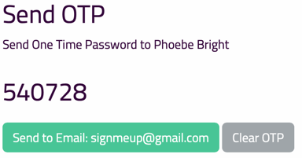

# Account Status

In order for a user's account to be fully activated there are a few steps to be completed.

1. User Registers with their name and email.  Their account status will look like this:

2. Once they have verified their email address, the account status will change to this:

3. Now their account must be Confirmed by the Administrator by clicking on the **Confirm Account** button.

## Manually Activate User Account

If for some reason the user has not received the verification email, you can verify their account for them by click the **Activate User** button.  Be aware that by doing this you have not confirmed that they can receive emails at this address, so you should check with them first.

## Send One Time Password

If the user has had a problem with activating their account or receiving the forgot email password, you can create a temporary password for them.  Click the **Send OTP** button to generate a one-time password like this

You can give them the number directly or send an email with the email button.  NOte that currently this OTP remains active until the user logs in. 

## Deactivate User Account 

Click the **Deactivate User** button to set the user's account status to inactive. This is useful if the user has violated terms of service or is no longer active. The user will not be able to log in until their account is reactivated.
