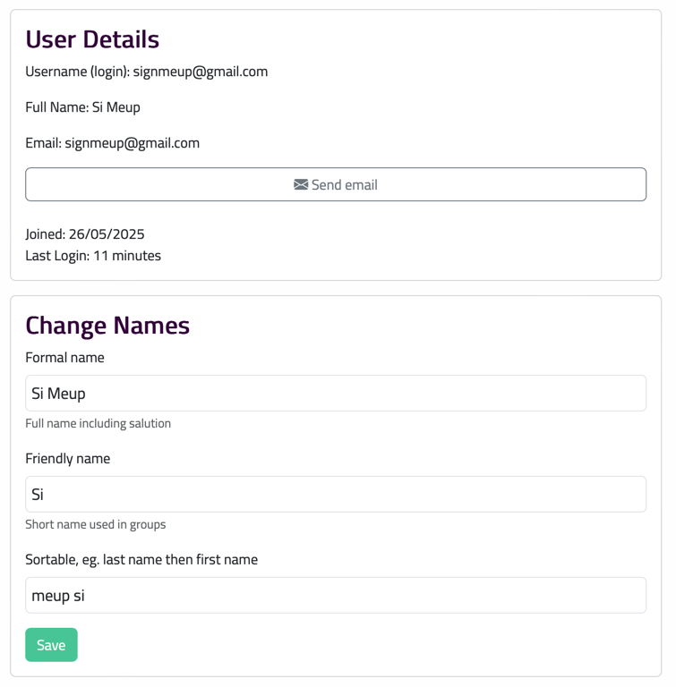

# User Details

## Names

In most places the Formal Name is used so this is normally in the first name and surname fields but modify here as required.

Friendly name is used in places where space is short.  Usually just the first name

If places where names are sorted, add how to sort the name here.
