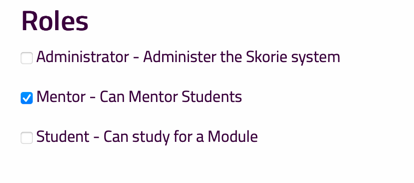

# User Roles

Normally a user will have one role and they will have this role throughout the system.

Assign the role by clicking the checkbox either on the User Details page or via the Manage Roles option on the Admin menu.

